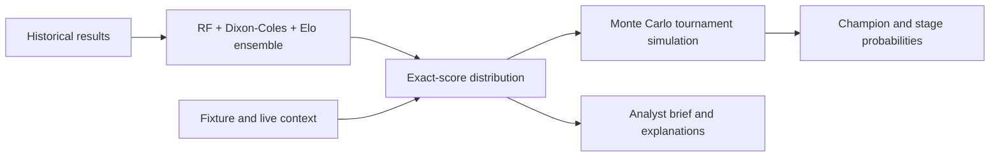

# World Cup 2026 Forecast Lab

A football analytics application that predicts exact match scores, simulates the expanded 48-team FIFA World Cup, and explains why its forecasts move.

The project combines a calibrated Random Forest + Dixon-Coles + Elo ensemble with Monte Carlo tournament simulation, fixture-aware context, live-state updates, and a local evidence-backed analyst.

## Why It Is Interesting

- Implements the new 48-team format: 12 groups, eight best third-place teams, and a Round of 32.
- Predicts a coherent exact-score distribution, then aggregates those scores into win/draw/loss and tournament probabilities.
- Separates historical training features from forecast-time signals such as lineups, availability, weather, travel, rest, and live results.
- Exposes the model through a FastAPI backend, interactive sports dashboard, CLI, and local RAG Intelligence Desk.
- Uses chronological holdouts and automated contract tests instead of relying only on visually plausible predictions.

## Five-Minute Setup

Prerequisite: Python 3.12.

```bash
python3 -m venv .venv
source .venv/bin/activate
python -m pip install --upgrade pip
python -m pip install -r requirements.txt
```

Run a baseline tournament simulation:

```bash
python scripts/predict_worldcup.py --sims 1000 --seed 26
```

Start the website:

```bash
uvicorn app.main:app --reload --host 127.0.0.1 --port 8000
```

Open `http://127.0.0.1:8000`.

The website and CLI can run without API keys or a trained model. When `models/worldcup_random_forest.joblib` is absent, predictions use the built-in football-strength and Poisson baseline.

## AI Matchroom

The public homepage at `http://127.0.0.1:8000/` is the focused AI Matchroom. The older `/ai` route remains as a compatibility alias.

- Open `http://127.0.0.1:8000/arena` for the dedicated multi-agent Prediction Arena.
- Open `http://127.0.0.1:8000/model-lab` for the dense machine-learning and model-operations workspace.
- The older `/dashboard` route remains as a compatibility alias.

The AI Matchroom combines the existing exact-score forecast with:

- same-position player comparisons and projected scorer timing
- manager-plan hypotheses for both teams
- availability, expected-minutes, and stamina signals
- local RAG evidence and optional LLM synthesis
- a live match board and a reasoned remaining-tournament simulation
- the complete simulated group and knockout path with exact scores; select any match to inspect its deductions

The reasoning layer explains the existing forecast and does not silently change its expected goals or probabilities. All 48 teams resolve to a manager skill and an explicit curation status. The current public-data pass contains 236 observed manager-match rows for 30 managers: 10 profiles qualify as evidence-backed, 20 remain limited-observed, and 18 are visible research gaps. Historical club or national-team behavior may not fully transfer to the manager's current World Cup squad.

```bash
curl -s -X POST http://127.0.0.1:8000/api/ai/match \
  -H "Content-Type: application/json" \
  -d '{"team_a":"France","team_b":"Brazil","use_model":true,"use_llm":false}'

curl -s -X POST http://127.0.0.1:8000/api/ai/tournament \
  -H "Content-Type: application/json" \
  -d '{"sims":250,"seed":26,"use_model":true}'
```

## Tactical API

The tactical endpoints explain the existing forecast without changing its expected goals or probabilities.

```bash
curl -s http://127.0.0.1:8000/api/tactics/managers

curl -s http://127.0.0.1:8000/api/tactics/manager/France

curl -s http://127.0.0.1:8000/api/tactics/coverage/France

curl -s -X POST http://127.0.0.1:8000/api/tactics/matchups \
  -H "Content-Type: application/json" \
  -d '{"team_a":"France","team_b":"Brazil","top_n":5}'

curl -s -X POST http://127.0.0.1:8000/api/tactics/brief \
  -H "Content-Type: application/json" \
  -d '{"team_a":"France","team_b":"Brazil","use_model":true,"top_matchups":5}'
```

Matchup edge scores are transparent ranking scores, not calibrated probabilities. Responses include source, data-quality, evidence-confidence meaning, observed-versus-estimated coverage, and explicit fallback notes when tactical data is missing.

## Refresh Tactical Evidence

The tactical subsystem has explicit ingestion and validation steps. They are deliberately separate from prediction so untested context cannot silently change forecast probabilities.

```bash
# Validate the current 48-team manager registry.
python scripts/sync_managers.py

# Optional network refresh of manager names, followed by manual source review.
python scripts/sync_managers.py --refresh

# Distill observed manager-match rows into transparent profiles.
python scripts/sync_manager_match_history.py \
  --provider-csv path/to/provider_manager_matches.csv \
  --provider provider-name
python scripts/distill_manager_profiles.py

# Or refresh the capped public StatsBomb manager-history sample and curate skills.
python scripts/sync_statsbomb_manager_history.py --max-matches-per-manager 12
python scripts/curate_manager_skills_from_history.py --apply

# Build stable squad identities, optionally linking a provider export.
python scripts/build_player_identity_map.py
python scripts/build_player_identity_map.py \
  --provider-csv path/to/provider_players.csv \
  --provider provider-name

# Normalize observed seasonal player stats and apply them as feature overrides.
python scripts/sync_observed_player_stats.py \
  --provider-csv path/to/provider_player_stats.csv \
  --provider provider-name \
  --apply

# Enable context only after it improves chronological holdout calibration.
python scripts/backtest_context_features.py
```

Current repository coverage is intentionally honest: all 48 teams have a current manager registry entry and manager-skill resolution. StatsBomb Open Data currently covers 30 managers across 236 capped historical match observations; 18 managers still need manager-specific event data and public tactical evidence. Existing player-match rows remain mostly estimated fallbacks rather than provider-observed stats, and the context feature gate therefore remains disabled.

See [docs/TACTICAL_DATA_PIPELINE.md](docs/TACTICAL_DATA_PIPELINE.md) for provider contracts, evidence levels, and activation criteria.

## Ingest Player Statistics

The manual-first ingestion adapter validates mixed season and match rows, writes provider-independent normalized files, and derives transparent player role and recent-form signals.

```bash
python scripts/ingest_player_stats.py --source manual_csv
python scripts/rebuild_player_role_vectors.py
python scripts/test_player_stats_ingestion.py
```

Use `data/raw/player_stats/manual_player_stats_sample.csv` as the input contract. Invalid rows are skipped and appended to `data/provenance/data_quality_report.csv`; successful and partial runs are recorded in `data/provenance/ingestion_runs.csv`.

Observed season statistics take precedence when building role vectors. Players without observed rows retain lower-confidence role vectors derived from `data/player_profiles.csv`. Role-fit scores are transparent ranking scores, not calibrated probabilities, and this ingestion phase does not retrain or alter the match predictor.

## Ingest Injury And News Evidence

The manual injury/news adapter converts free-form report statuses into a fixed vocabulary, computes confidence-aware availability and expected-minutes estimates, and consolidates multiple sources into reviewable risk signals.

```bash
python scripts/ingest_injury_news.py --source manual_csv
python scripts/test_injury_news_ingestion.py
```

Use `data/raw/injury_news/manual_injury_news_sample.csv` as the input contract. Normalized evidence is written to `data/normalized/injury_news_normalized.csv`, while consolidated signals are written to `data/derived/injury_risk_signals.csv`.

Contradictory meaningful statuses are preserved, marked with `needs_manual_review=true`, and logged to the shared data-quality report. Tactical code can read team and match-specific signals through `get_team_injury_risk_signals()`. This phase does not overwrite `data/player_availability.csv` or change prediction behavior.

## Refine Manager Skills From Tactical Evidence

The tactical-article adapter normalizes manually curated articles, match reports, press conferences, and decision records into a reviewable evidence table. Refinement is dry-run by default.

```bash
python scripts/ingest_tactical_articles.py --source manual_csv
python scripts/refine_manager_skills.py
python scripts/test_manager_refinement.py
```

Suggested updates are written to `data/derived/manager_skill_updates.csv`. Every suggestion references its supporting `evidence_id` values and is labelled as ready, conflicting, needing more evidence, unsupported, or requiring human review.

No manager-skill JSON is changed by the commands above. After reviewing the queue, eligible updates can be applied explicitly:

```bash
python scripts/refine_manager_skills.py --manager-id france_deschamps --apply
```

Only recurring, supported, human-reviewed evidence can be applied. Unreviewed or LLM-generated claims remain review-only. Apply mode adds evidence references and audit notes, validates the complete `ManagerSkill`, and atomically replaces the existing JSON.

## Ingest Post-Match Event Data

The event-data adapter maps provider-specific CSV columns and event labels into one typed event stream, then builds transparent match-team summaries.

```bash
python scripts/ingest_event_data.py --source manual_csv
python scripts/test_event_data_ingestion.py
```

Use `data/raw/event_data/manual_match_events_sample.csv` as the manual input example. The normalized contract supports shots, goals, passes, carries, defensive actions, substitutions, set pieces, penalties, and saves. Coordinates use a `120 x 80` attacking-direction pitch; future provider adapters should map their native coordinates before validation.

Derived summaries in `data/derived/match_summary_signals.csv` include xG, shots, field tilt, box entries, set-piece and counterattack xG, pressing proxies, and goalkeeper impact. Missing optional event details are retained as informational data-quality notices instead of causing the run to fail. These post-match signals are analysis and evaluation inputs only; they do not alter current predictions.

## Live Tournament Autopilot

Completed results are stored permanently in `data/observed_matches.csv`. The autopilot merges verified manual results with the official FIFA calendar score feed and optional provider refreshes, republishes `data/live_state.json`, rebuilds `data/live_team_state.csv`, ingests confirmed lineups, settles saved Arena predictions, evaluates completed matches, and refreshes calibration.

```bash
# Run safely from the verified local result ledger.
python scripts/run_tournament_autopilot.py

# Fetch official FIFA scores and publish nearby Arena forecasts.
python scripts/run_tournament_autopilot.py --refresh-official --run-arena

# Optionally combine official FIFA scores with configured provider APIs.
python scripts/run_tournament_autopilot.py --refresh-official --refresh-provider --run-arena

# Import confirmed starters and calculate tactical lineup deltas.
python scripts/ingest_lineups.py --from-confirmed-lineups

# Optional provider-independent live event feed.
python scripts/sync_live_events.py --optional
```

The scheduled workflow `.github/workflows/tournament-autopilot.yml` runs the same idempotent cycle during the tournament. The official FIFA calendar refresh does not need a secret. Configure repository secrets `BALLDONTLIE_API_KEY`, `SPORTMONKS_API_TOKEN`, and optionally `WORLD_CUP_EVENT_FEED_API_KEY`; configure `WORLD_CUP_EVENT_FEED_URL` as a repository variable. Scores remain durable even when a later provider request fails. Formation and event statistics are only treated as observed when a provider or verified import supplies them.

The official FIFA refresh stores final matches in `completed_matches` and keeps in-progress or scheduled rows in `live_state.current_matches`, so a live score is visible to the website without being treated as a permanent final result. These results feed the simulator through live-state locking and live team-form features.

## Agentic Update Agent

The project now includes a lightweight update agent inspired by current agentic workflow tools: it observes the tournament state, plans allowed tools, runs only explicit update actions, verifies what changed, and writes an audit report. It does not let an LLM execute arbitrary commands.

```bash
# See what the agent would do.
python scripts/run_update_agent.py --dry-run

# Update official scores, optional provider data, lineups, event feed, Arena cards, and audit logs.
python scripts/run_update_agent.py --apply --include-provider --run-arena

# Add compact verification after the update.
python scripts/run_update_agent.py --apply --include-provider --run-arena --verify
```

Reports are written to `data/agentic_update/latest_report.json` and appended to `data/agentic_update/update_runs.csv`. The web API exposes the same loop:

```bash
curl -X POST http://127.0.0.1:8000/api/update-agent/run \
  -H "Content-Type: application/json" \
  -d '{"apply":false}'

curl http://127.0.0.1:8000/api/update-agent/latest
```

## Data Provider Setup

Provider pricing and coverage can change. These were checked on June 13, 2026.

| Need | Provider | Free? | Where to get access |
| --- | --- | --- | --- |
| World Cup scores, rosters, lineups, stats, and shot maps | BALLDONTLIE | Yes, a basic free tier is listed at 5 requests/minute. Paid per-sport plans are listed for higher limits and fuller data. | [Create an account](https://app.balldontlie.io/) and set `BALLDONTLIE_API_KEY`. |
| Detailed observed formations and lineups | Sportmonks | Treat as a commercial provider. Trial and plan coverage should be checked before subscribing. | [Sportmonks Football API](https://www.sportmonks.com/football-api/) and set `SPORTMONKS_API_TOKEN`. |
| Venue weather | Open-Meteo | Yes for non-commercial evaluation and prototyping, without an API key. The open-access tier lists 10,000 calls/day and requires attribution. | [Open-Meteo docs](https://open-meteo.com/en/docs). |
| Historical event, lineup, and selected 360 data | StatsBomb Open Data | Yes, for selected historical competitions. It is not a live World Cup feed. | [StatsBomb Open Data](https://github.com/statsbomb/open-data). |
| Basic fixtures and results backup | football-data.org | Yes. Its free tier lists 12 competitions, basic fixtures/results/tables, and 10 calls/minute. Confirm that World Cup coverage is included before relying on it. | [Register for a token](https://www.football-data.org/client/register). |
| Optional market snapshot | The Odds API | Yes. Its starter tier lists 500 credits/month. | [Get an API key](https://the-odds-api.com/) and set `THE_ODDS_API_KEY`. |

`WORLD_CUP_EVENT_FEED_URL` is a provider-independent adapter, not a specific service. It can accept a JSON event feed using the project's normalized event fields. Rich live shot locations, pressure, carries, and heat-map-quality events are usually commercial data. The system deliberately leaves those fields unavailable instead of inventing them.

## Publish From GitHub

GitHub Pages only hosts static HTML, CSS, and JavaScript, so it cannot run this project's FastAPI forecasts, simulations, live refreshes, or reasoning endpoints. The repository includes `render.yaml` to deploy the complete app from GitHub on Render.

1. Commit and push the repository to GitHub.
2. Open `https://dashboard.render.com/blueprint/new?repo=https://github.com/KaiwenMo1/worldcup2026`.
3. Apply the Blueprint.
4. Add optional provider keys in the Render dashboard when available.

The deployed root route is the public Match Deductions page. Prediction Arena is at `/arena`, and the machine-learning workspace is at `/model-lab`.

The Render build installs the smaller `requirements-web.txt` dependency set and trains the real ensemble from committed historical matches. The large generated model artifact remains outside Git.

Render's filesystem is ephemeral. Durable tournament updates should continue through `.github/workflows/tournament-autopilot.yml`, which commits verified data updates back to GitHub and triggers a fresh deployment.

Recommended public commit contents:

- application source under `app/`, `scripts/`, and `tests/`
- `.github/workflows/`, `render.yaml`, documentation, and requirements
- curated and normalized CSV/JSON files required by the public experience
- the permanent observed-result ledger and live-state outputs

Keep `.env`, `kaggle.json`, `.venv/`, `node_modules/`, `models/*.joblib`, and downloaded `data/raw/` provider dumps out of Git. They are already ignored.

## Optional Multi-Model Arena

The deterministic Expert, Kevin, Upset, Skeptic, and Final Forecast agents always work offline. To add real OpenAI-compatible model opinions, configure `WORLD_CUP_ARENA_MODELS_JSON` with provider metadata and API-key environment-variable names. External opinions are displayed and audited, but they do not silently override the calibrated base forecast.

For Groq, add this to `.env`:

```bash
GROQ_API_KEY=your_key_here
WORLD_CUP_ARENA_MODELS_JSON=[{"provider_name":"Groq GPT-OSS","model":"openai/gpt-oss-120b","base_url":"https://api.groq.com/openai/v1","api_key_env":"GROQ_API_KEY"},{"provider_name":"Groq Llama","model":"llama-3.3-70b-versatile","base_url":"https://api.groq.com/openai/v1","api_key_env":"GROQ_API_KEY"},{"provider_name":"Groq Qwen","model":"qwen/qwen3-32b","base_url":"https://api.groq.com/openai/v1","api_key_env":"GROQ_API_KEY"}]
```

Then start the web app and open `http://127.0.0.1:8000/arena`:

```bash
uvicorn app.main:app --reload --host 127.0.0.1 --port 8000
```

Or run one Arena match from the CLI:

```bash
python scripts/run_prediction_arena.py \
  --match-id FRA-BRA-DEMO \
  --team-a France \
  --team-b Brazil \
  --stage knockout \
  --publish-card
```

The Arena runs configured external models independently alongside the deterministic football agents. Add more provider objects to `WORLD_CUP_ARENA_MODELS_JSON` to compare more models during the same run.

## Optional Research Scout Tools

The hosted predictor does not require crawler, browser, document, MCP, or agent-framework packages. For local research work, install the optional stack:

```bash
python -m pip install -r requirements-research.txt
python scripts/research_tool_doctor.py
```

The optional stack is designed for these roles:

- Agent-Reach: local capability router for web, GitHub, RSS, video, and social research.
- Crawl4AI: repeatable public-page crawling into LLM-ready Markdown.
- MarkItDown or Docling: convert PDFs and documents into reviewable Markdown evidence.
- PydanticAI: future typed orchestration path for evidence-grounded football agents.
- FastMCP: expose forecast, tactical brief, player profile, and evaluation tools to coding agents.

Collect one public research page into reviewable evidence:

```bash
python scripts/collect_research_evidence.py \
  --url "https://example.com/france-tactical-report" \
  --title "France tactical report" \
  --manager-id france_deschamps \
  --team France \
  --category tactical_reports
```

Collected files are written under `data/raw/research_evidence/` and indexed in `research_evidence_index.csv`. They are intentionally marked `raw_unreviewed_public_evidence`; a human should review them before extracting claims into `data/raw/tactical_articles/` or manager-skill evidence. Keep cookie/login-based Agent-Reach channels local only, and never commit cookies, session tokens, or scraped private content.

Agent-Reach gets a dedicated local workflow for manager research:

```bash
# Build the 48-manager public research queue.
python scripts/plan_agent_reach_research.py

# Or focus on one team.
python scripts/plan_agent_reach_research.py --team France

# Include weak/social channels only when you intentionally want login-local research.
python scripts/plan_agent_reach_research.py --team France --include-social
```

The generated queue is `data/derived/agent_reach_manager_research_plan.csv`. Give individual `agent_prompt` cells to an Agent-Reach-enabled assistant, save the resulting Markdown under `data/raw/research_evidence/agent_reach_inbox/{manager_id}/`, then import the local collection:

```bash
python scripts/import_agent_reach_evidence.py
```

Imported files are copied into the research evidence index and queued in `data/derived/agent_reach_tactical_review_queue.csv`. The queue starts with blank `claim_text` and `reviewed_by_human=false` by design; Agent-Reach can gather source material, but it cannot directly rewrite manager skills or prediction features.

## Evaluate Completed Matches

The post-match evaluator closes the feedback loop across model forecasts, manager-skill hypotheses, matchup edges, and immutable analyst logs.

```bash
# Evaluate one match already recorded in data/live_state.json.
python scripts/evaluate_completed_match.py --match-id 1

# Evaluate a manually supplied completed match.
python scripts/evaluate_completed_match.py \
  --match-id FRA-BRA-TEST \
  --team-a France \
  --team-b Brazil \
  --score-a 2 \
  --score-b 1 \
  --formation-a 4-2-3-1

# Re-evaluate every completed live-state match idempotently.
python scripts/evaluate_all_completed_matches.py
python scripts/test_postmatch_evaluation.py
```

Model evaluation reports exact-score hit, winner hit, multiclass Brier score, and the favorite's calibration bucket. Manager evaluation compares only available evidence for formation, pressing, transition xG, and substitution timing. Matchup evaluation uses type-specific event evidence, while analyst evaluation joins immutable predictions to optional post-game reviews.

Evaluation rows are idempotently upserted in `data/derived/`. Until pre-kickoff forecast snapshots are stored with live matches, CLI-generated model evaluations are explicitly labelled `current_model_replay_not_historical_snapshot`.

## Manager Skill Distillation

The project includes a Nuwa-inspired offline builder that turns manually curated public evidence into a reviewable manager `SKILL.md` and an app-compatible tactical JSON preview.

```bash
python scripts/create_manager_skill.py \
  --manager-id france_deschamps \
  --manager-name "Didier Deschamps" \
  --team France \
  --evidence-dir data/manager_distillation/raw_evidence/france_deschamps

python scripts/validate_manager_skill.py --manager-id france_deschamps
python scripts/export_manager_skill_json.py --manager-id france_deschamps
```

The exporter will not replace an existing `data/manager_skills/{manager_id}.json` unless `--apply` is supplied. Free-form Markdown remains research context; only recurring, predictive, distinctive structured claims can become executable tactical rules. See [skills/manager-skill-builder/SKILL.md](skills/manager-skill-builder/SKILL.md).

## Human Analyst Journal API

The journal stores immutable pre-match predictions and separate post-game reviews in local CSV files.

```bash
curl -s -X POST http://127.0.0.1:8000/api/analyst/log \
  -H "Content-Type: application/json" \
  -d '{"analyst":"Kai","match_id":"FRAvBRA","team_a":"France","team_b":"Brazil","predicted_team_a_score":2,"predicted_team_b_score":1,"confidence":0.72,"key_matchup_prediction":"France left wing creates the strongest edge","tactical_prediction":"France attacks transitions behind Brazil fullbacks","kickoff_at":"2026-06-20T20:00:00Z","model_version":"ensemble-2026.06","data_snapshot_id":"snapshot-001"}'

curl -s "http://127.0.0.1:8000/api/analyst/logs?analyst=Kai"

curl -s -X POST http://127.0.0.1:8000/api/analyst/postgame-review \
  -H "Content-Type: application/json" \
  -d '{"log_id":"REPLACE_WITH_LOG_ID","actual_team_a_score":2,"actual_team_b_score":1,"key_matchup_correct":true,"tactical_correct":false}'

curl -s http://127.0.0.1:8000/api/analyst/profile/Kai
```

Prediction logs must be created before kickoff. Reviews reference the original `log_id` and never rewrite the pre-match record. The CSV journal is an MVP intended for a local single-process deployment.

## Train And Evaluate The Ensemble

Train the chronological ensemble:

```bash
python scripts/train_model.py
```

Run a larger simulation using the saved model:

```bash
python scripts/predict_worldcup.py \
  --sims 10000 \
  --seed 26 \
  --model models/worldcup_random_forest.joblib \
  --save outputs/predictions.csv
```

Inspect the saved chronological model report:

```bash
python scripts/backtest_models.py
python scripts/backtest_models.py --by-year
```

Useful prediction commands:

```bash
python scripts/predict_worldcup.py --single
python scripts/predict_worldcup.py --match "France" "Brazil"
python scripts/predict_worldcup.py --sims 50000 --team "USA"
```

## Run Tests

```bash
python -m unittest discover -s tests -v
```

The suite protects the tournament data contract, 48-team qualification rule, exact-score probability math, local intelligence helpers, and core API surface. GitHub Actions also compiles the source and runs a small end-to-end prediction smoke test.

## How Predictions Work



The trained model uses only information available before each historical match. Current squad, tactical, weather, travel, lineup, and live-match signals are applied later as forecast-time context.

The saved model currently uses:

- 4,771 training matches.
- 1,597 calibration matches.
- 1,584 chronological holdout matches from October 8, 2024 through March 31, 2026.
- Ensemble holdout accuracy of `59.8%` and log loss of `0.863`.

These metrics describe the current local saved model and can change after retraining.

See [docs/ARCHITECTURE.md](docs/ARCHITECTURE.md) for component boundaries, data trust levels, validation strategy, and known tradeoffs.

## Product Surface

The dashboard focuses on four connected workflows:

1. **Tournament simulation**: champion odds, confidence ranges, groups, and a full two-sided bracket.
2. **Match forecast**: expected goals, exact-score heatmap, result probabilities, and model drivers.
3. **Analyst brief**: squad, tactical, weather, xG, penalty, market, and retrieved evidence summarized into one matchup view.
4. **Live tournament tracking**: completed results and eliminated teams update future simulations.

Advanced data modules include squad and player traits, shot-level xG, penalty matchup analysis, tactical profiles, set pieces, goalkeeper profiles, referee tendencies, market signals, and fixture-aware weather/travel context. They feed the forecast stack when data is available rather than acting only as separate dashboard widgets.

## Optional Live Data

No API key is required for the baseline app. To enable optional providers:

```bash
cp .env.example .env
```

Then configure only the providers you have access to:

- `SPORTMONKS_API_TOKEN`: observed lineups and sidelined players.
- `THE_ODDS_API_KEY`: one-time bookmaker snapshot.
- `BALLDONTLIE_API_KEY`: live World Cup state when supported by your plan.
- `WORLD_CUP_AI_*`: optional OpenAI-compatible or local-model synthesis.

StatsBomb Open Data and Open-Meteo do not require API keys.

Refresh local advanced context:

```bash
python scripts/sync_full_advanced_context.py \
  --lineups \
  --odds \
  --statsbomb \
  --weather \
  --fetch-weather \
  --optional-providers
```

Provider flags are optional. Projected local fallbacks remain in place when a provider is unavailable.

## Repository Guide

| Path | Purpose |
|---|---|
| `scripts/train_model.py` | Chronological feature building, ensemble training, calibration, and report generation |
| `scripts/predict_worldcup.py` | Exact-score prediction and Monte Carlo tournament simulation |
| `scripts/backtest_models.py` | Inspect the saved chronological model report |
| `scripts/build_advanced_context.py` | Build forecast-time context from local and provider data |
| `scripts/sync_managers.py` | Validate or refresh the current 48-team manager registry |
| `scripts/sync_manager_match_history.py` | Normalize observed manager-match exports with explicit identity checks |
| `scripts/sync_statsbomb_manager_history.py` | Build capped observed manager-match history from public StatsBomb event data |
| `scripts/distill_manager_profiles.py` | Turn observed manager-match history into transparent tactical features |
| `scripts/curate_manager_skills_from_history.py` | Enrich manager skills from observed history and publish the 48-manager curation ledger |
| `scripts/build_player_identity_map.py` | Maintain stable squad-to-provider player identities |
| `scripts/sync_observed_player_stats.py` | Normalize provider seasonal stats and apply observed overrides |
| `scripts/ingest_player_stats.py` | Validate manual season/match stats and write provider-independent normalized files |
| `scripts/rebuild_player_role_vectors.py` | Derive transparent role-fit vectors and recent-form signals with curated fallbacks |
| `scripts/ingest_injury_news.py` | Normalize manual injury/news evidence and derive conflict-aware availability-risk signals |
| `scripts/ingest_tactical_articles.py` | Normalize manually curated tactical articles and match-report evidence |
| `scripts/refine_manager_skills.py` | Build a dry-run manager-skill review queue and explicitly apply eligible evidence-backed updates |
| `scripts/ingest_event_data.py` | Map provider-style match events into a normalized stream and transparent post-match summaries |
| `scripts/evaluate_completed_match.py` | Evaluate one completed match across model, manager, matchup, and analyst layers |
| `scripts/evaluate_all_completed_matches.py` | Idempotently evaluate every completed match in the live-state feed |
| `scripts/backtest_context_features.py` | Chronologically gate manager/player context before forecast integration |
| `app/main.py` | FastAPI routes and forecast orchestration |
| `app/ai_forecast/` | Evidence-aware match reasoning, player comparisons, and tournament explanations |
| `app/tactics/` | Transparent manager plans, player matchups, and forecast-read-only tactical briefs |
| `app/ingestion/` | Shared typed schemas, safe CSV utilities, player-stat adapters, source registry, and append-only provenance logs |
| `app/evaluation/` | Explainable post-match model, manager, matchup, and analyst feedback loop |
| `app/manager_distillation/` | Nuwa-inspired evidence loading, claim validation, manager-skill generation, and tactical JSON export |
| `app/intelligence.py` | Local evidence retrieval, tool routing, and optional LLM synthesis |
| `app/static/` | Public Match Deductions page, Prediction Arena, and separate Model Lab |
| `data/` | Tournament, training, context, and live-state inputs |
| `data/provenance/` | Source registry, ingestion run history, and structured data-quality issues |
| `tests/` | Automated project contracts |
| `docs/ARCHITECTURE.md` | System design, data flow, and known tradeoffs |
| `docs/TACTICAL_DATA_PIPELINE.md` | Tactical evidence ingestion, provenance, coverage, and feature-gate rules |
| `skills/manager-skill-builder/` | Project-local workflow for creating reviewable evidence-backed manager skills |
| `PROJECT_SUMMARY.md` | Concise recruiter and resume-oriented project summary |

## Limitations

- Forecasts are probabilities, not facts or guaranteed betting outcomes.
- Some squad, tactical, player, and availability fields are projected fallbacks until observed provider data is available.
- Shot-level xG and penalty models currently use smaller datasets than the match-result model.
- The JSON live-state store is designed for a local single-process app, not concurrent production writers.
- Models are generated locally and excluded from Git because the main model artifact is large.

## Current Direction

The next engineering priorities are stronger data provenance, provider adapters with reliable schemas, production-safe live-state persistence, and deeper calibration monitoring during the tournament. The goal is to improve this football-specific forecasting system without turning it into a generic dashboard.
