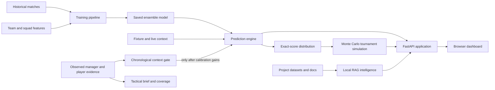

# Architecture

This document explains how the World Cup 2026 Predictor turns historical results and current tournament context into exact-score forecasts, tournament simulations, and evidence-backed analysis.

The project is a local-first football analytics prototype. It is intentionally designed so the baseline predictor and website work without paid APIs. Optional providers improve forecast-time context when credentials are available.

## System Map

## Prediction Lifecycle

1. `scripts/train_model.py` builds leakage-safe, chronological match features from `data/historical_matches.csv`.
2. Training fits Random Forest result and goal models, Dixon-Coles score modeling, and Elo-based probabilities.
3. A calibration layer combines component probabilities into the saved ensemble model.
4. `scripts/predict_worldcup.py` converts model probabilities into normalized exact-score distributions.
5. Monte Carlo simulation applies the 48-team rules: 12 groups, 24 automatic qualifiers, eight best third-place teams, and a Round of 32.
6. `app/main.py` adds forecast-time context such as fixtures, lineups, availability, weather, travel, rest, live results, and market signals.
7. `app/intelligence.py` retrieves local evidence and explains forecasts through an inspectable tool and evidence trace.

## Major Components

| Component | Responsibility | Main files |
|---|---|---|
| Training | Build chronological features, fit models, save evaluation report | `scripts/train_model.py`, `scripts/tune_model.py`, `scripts/backtest_models.py` |
| Prediction core | Teams, exact scores, qualification rules, Monte Carlo simulation | `scripts/predict_worldcup.py` |
| Context builders | Convert optional provider or open data into forecast-time signals | `scripts/sync_*.py`, `scripts/build_advanced_context.py` |
| Tactical evidence | Register managers, resolve player identities, normalize observed stats, and distill transparent context | `app/tactics/`, `scripts/sync_managers.py`, `scripts/distill_manager_profiles.py`, `scripts/build_player_identity_map.py`, `scripts/sync_observed_player_stats.py` |
| Manager skill distillation | Convert six-stream public evidence into validated human-readable skills and app-compatible manager JSON previews | `app/manager_distillation/`, `skills/manager-skill-builder/`, `scripts/create_manager_skill.py` |
| Ingestion and derivation | Provide typed source/run/quality contracts, non-throwing validation, safe CSV storage, player-stat and injury/news normalization, transparent derived signals, and append-only provenance | `app/ingestion/`, `data/normalized/`, `data/derived/`, `data/provenance/` |
| Post-match evaluation | Compare forecasts and tactical hypotheses with completed results and event-derived evidence using idempotent, explainable rows | `app/evaluation/`, `scripts/evaluate_*`, `data/derived/*evaluation*.csv` |
| Context activation gate | Compare baseline and manager/player-context models on chronological holdouts before integration | `scripts/backtest_context_features.py`, `data/context_feature_gate.json` |
| Web API | Orchestrate predictions, live state, analysis, and static frontend | `app/main.py` |
| Intelligence | Local TF-IDF retrieval, entity detection, tool routing, optional LLM synthesis | `app/intelligence.py` |
| Frontend | Simulation controls, bracket, score matrix, model report, analyst brief | `app/static/` |
| Contracts | Protect tournament shape, probability math, and core API surface | `tests/` |

## Data Trust Levels

The model deliberately separates data by how confidently it can be treated:

| Level | Examples | How it is used |
|---|---|---|
| Observed historical | International results, event data | Training and backtesting |
| Published tournament | Teams, groups, fixtures, venues | Tournament structure and automatic context |
| Observed current | Confirmed lineups, injuries, live results, odds | Overrides or updates forecast-time context |
| Projected fallback | Likely lineups, tactical and squad priors | Used only when observed current data is unavailable |

Live and provider-derived inputs are optional. The baseline predictor remains usable from repository data, while the UI reports signal availability and data quality.

Manager registration, tactical skill hypotheses, observed manager history, projected player profiles, and observed provider stats are separate concepts. A registered manager without evidence receives a neutral tactical fallback. Tactical briefs expose this coverage, and manager/player context stays explanation-only until `data/context_feature_gate.json` records a passing chronological comparison.

The player-stat ingestion path preserves the same distinction. Observed manual or future provider rows become normalized season and match records. Derived role vectors prefer observed season statistics, then fall back to lower-confidence manually curated profiles. Role-fit and form scores are inspectable ranking signals; this phase does not feed them into training or silently alter forecasts.

Injury/news ingestion follows the same evidence-first boundary. Reports normalize into a fixed status vocabulary and receive confidence-aware availability estimates. Multiple reports are consolidated without hiding disagreements: contradictory meaningful statuses remain visible, require manual review, and enter the shared quality log. Derived injury-risk signals are available to tactical analysis but do not overwrite the existing forecast availability table.

Manager refinement also uses an explicit review boundary. Tactical articles and match reports normalize into evidence rows with source quality, confidence, origin, and human-review metadata. The derived manager-skill update queue always cites evidence IDs. Dry-run mode never touches manager JSON; explicit apply accepts only recurring, supported, human-reviewed claims, then validates and atomically replaces the complete skill. LLM-generated claims cannot directly apply.

Post-match event ingestion uses adapter mappings instead of assuming one provider schema. Native column names and event labels normalize into a typed event stream on a `120 x 80` attacking-direction pitch. Missing optional details become informational quality issues, while malformed required values are rejected without stopping the run. Derived match-team summaries expose inspectable xG, territorial, transition, pressing, set-piece, and goalkeeper signals for analysis and future post-match evaluation; they do not feed the current forecast.

Post-match evaluation is a downstream feedback loop, not a forecast input. Model rows expose winner and score accuracy, multiclass Brier score, and calibration buckets. Manager-skill components exclude missing evidence instead of counting it as failure. Matchup edges use type-specific event evidence, and analyst rows preserve the immutable pre-match journal. Evaluation CSVs use stable IDs and idempotent upserts. Current-model replays are labelled explicitly until pre-kickoff snapshots are persisted with completed matches.

## Runtime Boundaries

- The CLI is the simplest deterministic entry point for tournament simulation.
- FastAPI serves the static dashboard and exposes prediction and analysis endpoints.
- Models are generated artifacts under `models/` and are not committed.
- `data/live_state.json` records completed matches and eliminated teams for local tournament tracking.
- API keys are read from `.env`; `.env` and model artifacts are excluded from Git.
- Future provider adapters share `app/ingestion/` so malformed rows become reviewable quality issues rather than pipeline-wide crashes.

## Validation

The project uses chronological train, calibration, and test periods rather than a random split. The current saved report evaluates 1,584 holdout matches from October 8, 2024 through March 31, 2026.

Automated contract tests cover:

- 48 unique teams across 12 groups of four.
- The top-two plus eight-best-third-place qualification rule.
- Normalized exact-score and result probabilities.
- Core API route and response shape.
- Complete 48-team manager registry and tactical evidence coverage reporting.
- Manager-history distillation, player identity mapping, provider-stat normalization, and the disabled-by-default context gate.
- Manual player-stat validation, normalized round trips, role archetype scoring, compact-position handling, and curated-profile fallback.
- Injury/news status normalization, confidence-aware estimates, conflict detection, derived-signal round trips, and match-specific team lookup.
- Tactical evidence normalization, evidence-linked manager update suggestions, conflict handling, LLM-claim blocking, dry-run immutability, and validated explicit apply.
- Provider-mapped event normalization, complete supported-event vocabulary, optional-field quality notices, transparent match-summary metrics, and prediction isolation.
- Model Brier/calibration math, manager partial-evidence scoring, event-backed matchup checks, analyst-log joins, and idempotent evaluation storage.
- Local intelligence aliases and retrieval text behavior.

CI runs the contract suite, compiles Python sources, checks installed dependencies, and performs a small end-to-end simulation.

## Known Tradeoffs

- `app/main.py` currently centralizes orchestration and several context adapters. As the live-update surface grows, the next extraction points are provider adapters and live-state persistence.
- The local JSON live-state store is appropriate for one local process, not concurrent production writers.
- Some current squad and tactical inputs are projected fallbacks rather than licensed real-time observations.
- Forecasts are probabilistic research outputs, not guaranteed outcomes or betting advice.

These tradeoffs are documented so future improvements deepen this football-specific system instead of replacing it with a generic application structure.
